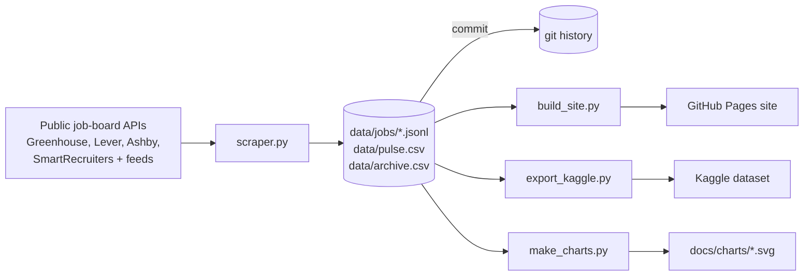

<p></p>

An open job database that updates itself. A scraper reads the public job-board APIs of company career pages, keeps every posting in git, works out what each one asks for (level, field, years of experience, skills, pay), tracks when postings disappear, and publishes the result as a searchable website and a Kaggle dataset. Everything runs on GitHub Actions, and the charts below are drawn by the workflow itself.

**[Search the jobs](https://chandranshb.github.io/roleBase/)** · **[Kaggle dataset](https://www.kaggle.com/datasets/chandranshbinjola/job-listings)** · **[Roadmap](../../issues)**

## What's in it right now

<table>
  <tr>
    <td></td>
    <td></td>
  </tr>
  <tr>
    <td></td>
    <td></td>
  </tr>
  <tr>
    <td></td>
    <td></td>
  </tr>
</table>

The charts are regenerated after every scrape by [`make_charts.py`](make_charts.py), which writes plain SVG with the standard library. No plotting package and no outside service is involved. The "over time" chart starts with the first day of tracking and fills in as the scraper keeps running.

## What it figures out for each job

| Field | How |
|---|---|
| **Company** | Display name from [`companies.json`](companies.json); feed names are cleaned ("Stripe, Inc." becomes "Stripe") |
| **Level** | Intern, junior, mid, senior, lead, staff+ or manager+, from the title, then from years of experience, then from the board's own label |
| **Field** | Engineering, data, design, product, sales, marketing and so on, from the title and team |
| **Years of experience** | First "N years ... experience" after the requirements heading; empty if not stated |
| **Skills** | Up to 8 technologies from a fixed keyword list |
| **Pay** | Yearly range, from the board's data or written in the posting |
| **Fresher-friendly** | Open to 0–2 years: states 2 years or less, or is an intern/junior role that states nothing. A "junior" job asking 3+ years does not count |
| **Ghost-job flag** | Points for age, talent-pool wording, agencies, many identical postings and reposts. A guess, never proof |
| **Open or closed** | A job missing from a board that fetched successfully gets a `closed_at` date |

All of this is read from posting text with simple rules, so expect mistakes. Level and field are the most reliable. Pay and years are only filled when a posting states them.

## How it works



- [`scrape.yml`](.github/workflows/scrape.yml) runs every 6 hours: tests, scrape, charts, commit the changes, deploy the site.
- [`kaggle.yml`](.github/workflows/kaggle.yml) runs daily: builds `jobs.csv` and `jobs_by_company.csv` and publishes a new dataset version.
- A failed source never closes its jobs, and an unexpectedly empty answer is treated as a failure too.
- Jobs that closed more than 90 days ago are dropped from the live files. Their lifetime is kept in `data/archive.csv`, and open and fresher counts per board are logged daily in `data/pulse.csv`. Both are append-only, so git stores only new lines.

### Why the data stays small in git

- One file per board, sorted and compact, so a change touches only the boards that changed.
- Empty values are not stored. The apply link, level and field are rebuilt on load when they can be derived.
- Descriptions are read and thrown away; only the extracted facts are kept.

## Data

`data/jobs/<source>_<board>.jsonl` has one JSON object per line. Empty fields are left out.

| Key | Meaning |
|---|---|
| `id` | `<source>:<board>:<id on that board>` |
| `company`, `title`, `team`, `location`, `remote` | As posted |
| `level`, `category`, `employment` | Inferred (see above); `level` and `category` are only stored when they differ from what the title implies |
| `years`, `skills`, `pay` | Years of experience, skill list, `[min, max, currency]` |
| `url` | Apply link (left out when it follows the board's standard pattern) |
| `posted`, `first_seen`, `closed_at` | Dates; empty `closed_at` means still open |
| `reposts` | Earlier closed jobs with the same title on the same board |

The Kaggle dataset has the same data as flat CSV, plus `jobs_by_company.csv` (open roles and fresher share per company).

## Run it yourself

```bash
pip install requests
python test_scraper.py     # self-checks, no network
python scraper.py          # fetch everything and update data/
python make_charts.py      # redraw docs/charts/
python build_site.py       # build _site/ for GitHub Pages
```

**Add a company:** find its board slug (the last part of `boards.greenhouse.io/<slug>`, `jobs.lever.co/<slug>` or `jobs.ashbyhq.com/<slug>`) and add `"slug": "Display Name"` under the right key in [`companies.json`](companies.json). Dead slugs show up as `FAIL` lines in the log and never close anything.

## Good citizen

- Only public, documented job-board APIs and feeds are used. Sites that forbid scraping (LinkedIn, Indeed, Naukri and similar) are left out on purpose.
- Every listing belongs to its employer and links back to the original posting. Remotive and RemoteOK entries link to their own pages as their terms ask, and are left out of the Kaggle dataset.
- The scraper identifies itself with a user agent and backs off on rate limits.

## Roadmap

Things that need weeks or months of history first, such as how long postings stay open, hiring freezes, skill trends and seasonality, are tracked as [issues](../../issues?q=label%3Aneeds-history).
